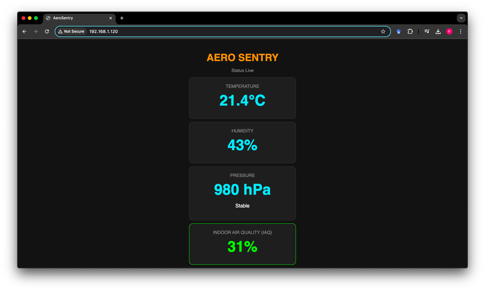

# Aero Sentry: IoT Air Quality & Weather Station

**Aero Sentry** is a personal IoT project designed to monitor indoor environmental conditions in real-time. Built on the **ESP32** platform, the system integrates a **BME680** sensor to track air quality (IAQ), temperature, humidity, and pressure. Data is visualized simultaneously on a local TFT dashboard, an LED indicator bar, and a remote web server accessible via any browser.

## Project Overview

The primary goal of this project was to create a standalone, connected device capable of assessing air quality trends and providing immediate visual feedback.

### Key Features
* **Real-Time Monitoring:** Continuous sampling of Temperature, Humidity, Pressure, and Gas Resistance (IAQ).
* **Dual Interface:**
    * **Local Display:** 2.4" TFT screen (ILI9341) showing current stats and status messages.
    * **Web Dashboard:** Hosted directly on the ESP32, accessible via local Wi-Fi, presenting styled gauge-like cards for all metrics.
* **Visual Feedback:**
    * **LED Bar:** 8-segment LED strip providing immediate, at-a-glance status indication.
    * **Web Indicators:** Dynamic color coding for air quality levels (Green/Red).
* **Trend Analysis:** Algorithms to predict weather changes (e.g., "Better weather coming") based on pressure history.
* **NTP Synchronization:** Automatic time fetching for accurate timestamps.

## Hardware Architecture

### Components
* **Microcontroller:** ESP32 Dev Module
* **Sensor:** Bosch BME680 (I2C)
* **Display:** 2.4" TFT LCD ILI9341 (SPI)
* **Indicator:** 8-LED Bar Module
* **Network:** Wi-Fi (Station Mode)

### Wiring Diagram & Pin Mapping

 
*Above: Physical connection diagram.*

#### 1. LED Bar (Left Side)
*8-segment LED module for status indication.*

| LED Segment | ESP32 Pin | Note |
| :--- | :--- | :--- |
| **D1 (First)** | GPIO 13 | |
| **D2** | GPIO 12 | |
| **D3** | GPIO 14 | |
| **D4** | GPIO 27 | |
| **D5** | GPIO 26 | |
| **D6** | GPIO 25 | |
| **D7** | GPIO 33 | |
| **D8 (Last)** | GPIO 32 | |
| **COM / GND** | GND | Common Ground |

#### 2. BME680 Sensor (Center/Bottom)
*Connected via I2C bus (Address 0x76).*

| Pin | ESP32 Pin | Function |
| :--- | :--- | :--- |
| **VCC** | 3V3 | Power Supply |
| **GND** | GND | Ground |
| **SCL** | GPIO 22 | I2C Clock |
| **SDA** | GPIO 21 | I2C Data |
| **SDO** | GND | Sets Address to 0x76 |
| **CS** | 3V3 | Selects I2C Mode |

#### 3. TFT ILI9341 Display (Right Side)
*Connected via SPI bus.*

| Pin | ESP32 Pin | Function |
| :--- | :--- | :--- |
| **VCC** | 3V3 / VIN | Power (VIN recommended for brightness) |
| **GND** | GND | Ground |
| **CS** | GPIO 15 | Chip Select |
| **RESET** | GPIO 4 | Reset |
| **DC** | **GPIO 5** | Data/Command |
| **MOSI** | GPIO 23 | SPI Data |
| **SCK** | GPIO 18 | SPI Clock |
| **LED** | 3V3 / VIN | Backlight Power |
| **MISO** | NC | Not Connected |

## Project Structure

The repository is organized for Arduino IDE compatibility.

    ├── AeroSentry/
    │   └── AeroSentry.ino       # Main application logic (Sensors, WebServer, TFT)
    ├── img/
    │   ├── hardware_setup.jpg   # Photo of the physical device
    │   └── web_dashboard.png    # Screenshot of the browser interface
    ├── .gitignore               # Standard exclusion rules
    ├── LICENSE                  # MIT License
    └── README.md                # Project documentation

## Setup and Installation

To reproduce this project, you will need the Arduino IDE with ESP32 board support.

1. **Clone the repository:**

        git clone https://github.com/BeneNat/aero-sentry-esp32.git

2. **Install Libraries:**
   Install the following dependencies via Arduino Library Manager:
    * `TFT_eSPI` (Bodmer)
    * `Adafruit BME680 Library`
    * `Adafruit Unified Sensor`

   *Note: Ensure `TFT_eSPI` is configured for ILI9341 and the correct pins (DC=5, RST=4, CS=15) in its `User_Setup.h` file or via a custom setup file.*

3. **Configuration:**
   Open `AeroSentry/AeroSentry.ino` and update your Wi-Fi credentials:

        const char* ssid = "YOUR_WIFI_SSID";
        const char* password = "YOUR_WIFI_PASSWORD";

4. **Upload:**
   Connect your ESP32 via USB and upload the sketch. The Serial Monitor (115200 baud) will output the device's IP address upon successful connection.

## Web Interface

Once the device is connected to Wi-Fi, navigating to its IP address reveals the dashboard.

 
*Above: Responsive web interface served by the ESP32.*

## Authors and Context
* **Author:**
    * Filip Żurek
* **Project Type:** Personal Engineering Project
* **Domain:** IoT, Embedded Systems, Environmental Monitoring

## License
This software is distributed under the MIT License. Refer to the [LICENSE](LICENSE) file for the full text.

---
*Aero Sentry - Personal IoT Project 2025*